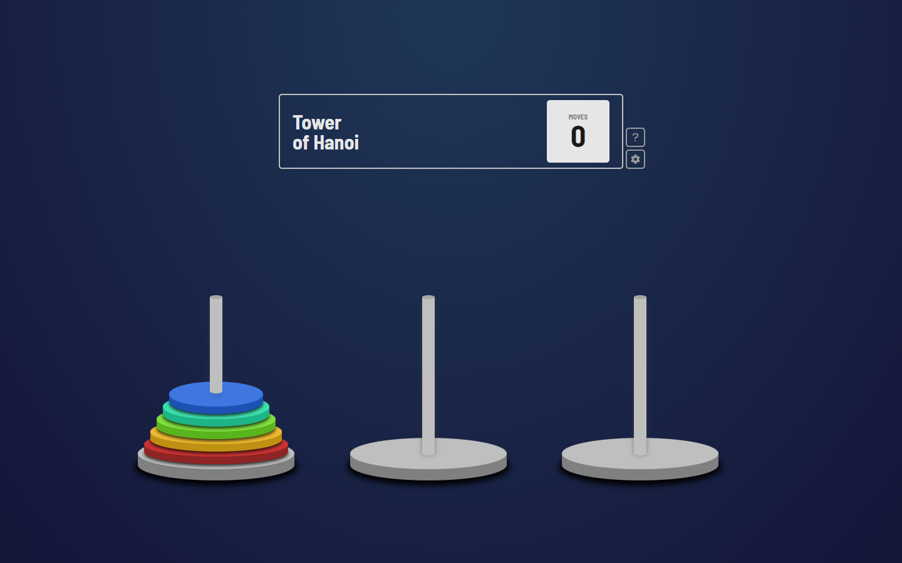

# Tower Of Hanoi

A simple tower of hanoi game with auto solve function using recursion.
[Live Demo](https://njvs.githuib.io/Tower-of-hanoi)



## The Game

Tower of Hanoi consist of three pegs or towers with `N` floors placed one over the other. The objective of the puzzle is to move the stack from the `Tower A` to the `Tower C` following these simple rules:
- Only one floor can be moved at a time.
- No floors may be placed/stacked on top of a smaller floor.

I also add some setting for increasing/decreasing the number of floors, and reset/solve button.

## Solve using Recursion

I build the floors from biggest to smallest. Means that the higher the floor number, the smaller it gets. And the top floor will be the highest floor number. I just want to point this out because most of the explanation i've found, they're using the other way around. 

```js
const towers = [ [1, 2, 3], [], [] ]; // initial towers where N=3
```

The idea is to use the auxilliary tower (`Tower B`) to reach the destination (`Tower C`) using recursion:
- Move `N-1` floors from `Tower A` to `Tower B`, using `Tower C`:
```js
towers = [ [1, 2], [], [3] ] // step 1
       = [ [1], [2], [3] ]   // step 2
       = [ [1], [2, 3], [] ] // step 3
```
- Move `1st` floor from `Tower A` to `Tower C`:
```js
towers = [ [], [2, 3], [1] ] // step 4
```
- Move `N-1` floors from `Tower B` to `Tower C`, using `Tower A`:
```js
towers = [ [3], [2], [1] ]     // step 5
       = [ [3], [], [1, 2] ]   // step 6
       = [ [], [], [1, 2, 3] ] // step 7 (SOLVED)
```
<br><br>
By following the idea above, here's the steps to solve the problem:
- Create a function `solve` with parameters `N`(number of floors to be moved), `from`(tower where floor is present), `aux`(helper tower), `to`(tower where floor is to be moved)
- Add `if` statement where if `N=1`, move floor from `from` to `to`.
- Else, call function `solve` for `N-1` ie. the number of floors minus 1
- Recall function `solve` for N-1 floor and move it `from` to `to`
- Recall function again using recursion until number of floors is 1 `N=1`

```js
function solve(N, from, aux, to) {
    if (N === 1) {
        console.log(`Move floor ${N} from ${towers[from]} to ${towers[to]}`);
        return
    } else {
        solve(N - 1, from, to, aux);
        solve(1, from, aux, to);
        solve(N - 1, aux, from, to);
    }
}

// call
const N = 3;
solve(N, 0, 1, 2);
```

### Algorithmic Complexity

<b>Time Complexity</b>: `Exponential - O(N^2)` 2* 2* 2* ... 2(N times)
<br>
<b>Auxiliary Space</b>: `Linear - O(N)` Function call stack space

## Useful Resources

I could never, or at least it would take me more time if it werent for this.
- [Recursion and stack](https://javascript.info/recursion) - Article
- [Data Structure & Algorithms - Tower of Hanoi](https://www.tutorialspoint.com/data_structures_algorithms/tower_of_hanoi.htm) - Article
- [Tower of Hanoi | GeeksforGeeks](https://www.youtube.com/watch?v=YstLjLCGmgg&t=130s) - Youtube Video